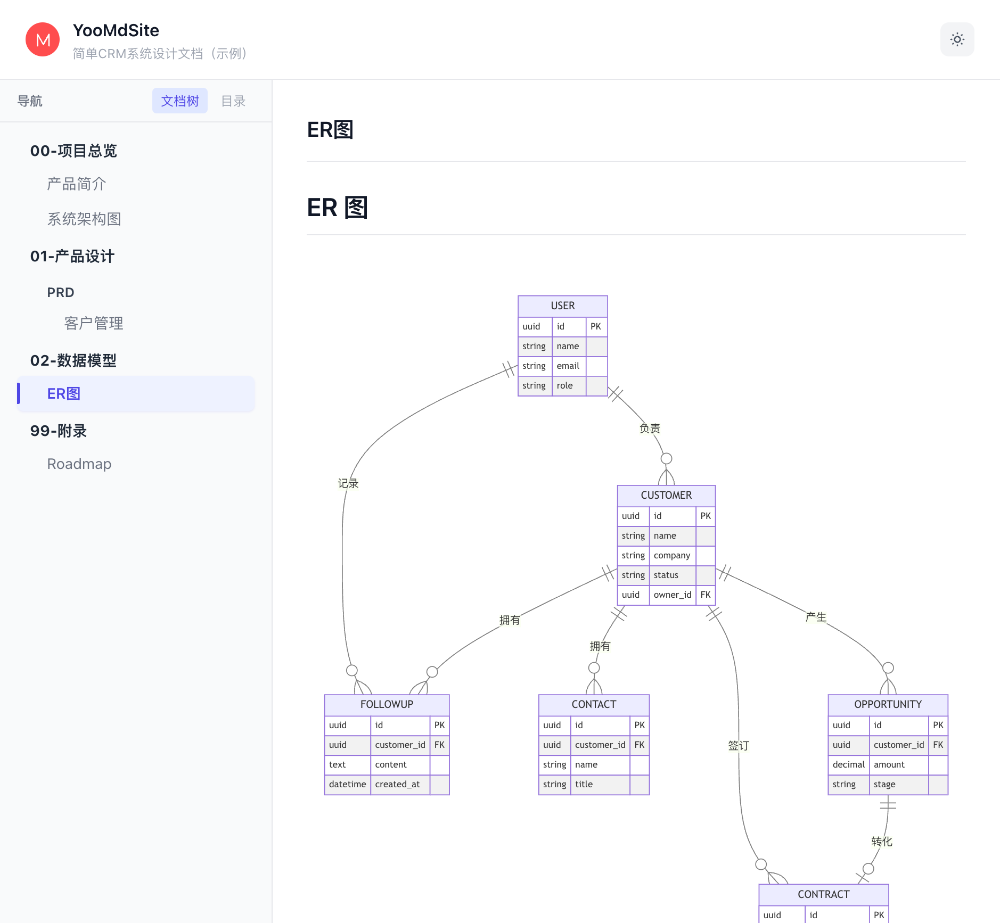

# YooMdSite

通用的 Markdown 文档阅读平台，支持在线查看 Markdown 格式的设计文档，包括 Mermaid 流程图、ER 图、状态图等。将Markdown文档添加到项目中，即可在线查看，支持多级目录、多文件。

## 功能特性

- **Markdown 文档渲染**：支持完整 Markdown 语法
- **Mermaid 图表**：自动渲染流程图、ER 图、状态机、时序图等
- **侧边栏导航**：按模块分类，快速切换文档
- **代码高亮**：支持多种语言语法高亮
- **响应式设计**：支持移动端查看
- **深色模式**：支持亮色/暗色主题切换
- **本地文档路径**：直接读取本地文档目录

## 界面预览



## 快速开始

```bash
# 安装依赖
pnpm install

# 启动开发服务器
pnpm dev
```

访问 http://localhost:4321/

## 配置

### 文档路径配置

编辑 `src/config.ts` 配置文档项目路径：

```typescript
export const docsConfig = {
  siteName: "YooMdSite",
  docsPaths: [
    {
      name: "我的项目",
      path: "./content/docs/my-project",
      description: "我的项目文档说明",
    },
  ],
  defaultDoc: "我的项目",
};
```


## 文档目录规范

建议使用以下目录命名规范：

```
content/docs/your-project/
├── 00-项目总览/
│   ├── 01-产品简介.md
│   └── 02-系统架构图.md
└── 99-附录/
```

编号前缀用于控制显示顺序。

## 技术栈

- **Astro 4.x** - 静态站点生成
- **Tailwind CSS 3.x** - 样式框架
- **Markdown-it** - Markdown 解析
- **Highlight.js** - 代码高亮
- **Mermaid** - 图表渲染

## 构建

```bash
pnpm build
pnpm preview
```

## License

Apache 2.0
