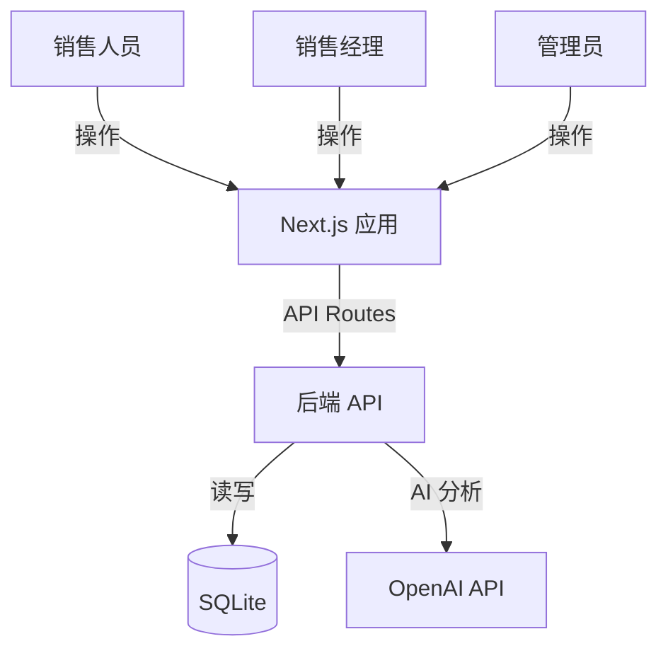

# 系统架构图

## 系统上下文



## 技术选型

| 层级 | 技术 | 原因 |
| --- | --- | --- |
| 全栈框架 | Next.js 14+ | 前后端一体化，部署简单 |
| 前端 UI | React + Tailwind | 轻量灵活，快速构建响应式界面 |
| 数据库 | SQLite | 零配置，单文件易备份 |
| AI | OpenAI API | 兼容 OpenAI 接口，性价比高 |

## 项目结构

```
simple-crm/
├── src/
│   ├── app/                    # Next.js App Router
│   │   ├── (dashboard)/        # 主应用页面
│   │   │   ├── customers/      # 客户管理
│   │   │   └── opportunities/  # 商机管理
│   │   └── api/                # API Routes
│   ├── components/             # React 组件
│   └── lib/                    # 工具函数
├── prisma/                     # 数据库 Schema
└── public/
```