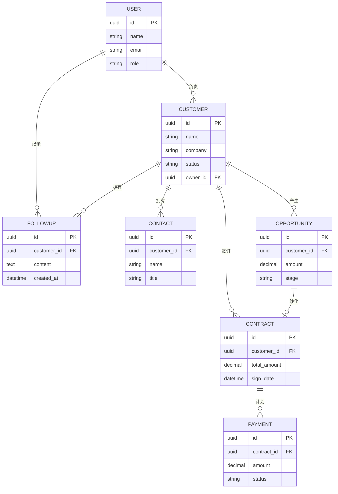

# ER 图

## 核心关系说明

| 关系 | 类型 | 说明 |
| --- | --- | --- |
| USER → CUSTOMER | 一对多 | 一个销售负责多个客户 |
| CUSTOMER → CONTACT | 一对多 | 一个客户有多个联系人 |
| CUSTOMER → FOLLOWUP | 一对多 | 一个客户有多次跟进 |
| CUSTOMER → OPPORTUNITY | 一对多 | 一个客户产生多个商机 |
| CONTRACT → PAYMENT | 一对多 | 一个合同有多个回款计划 |