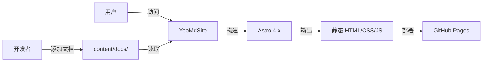
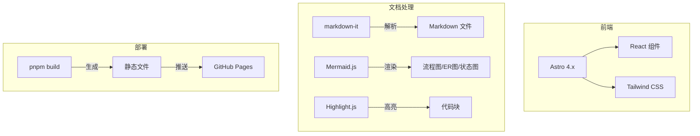

# YooMdSite 系统架构

## 系统上下文图



## 技术架构图



## 技术选型

| 层级 | 技术 | 原因 |
| --- | --- | --- |
| 框架 | Astro 4.x | 静态站点生成，性能优秀 |
| 样式 | Tailwind CSS 3.x | 原子化 CSS，快速构建 UI |
| Markdown | markdown-it | 轻量、可扩展的 Markdown 解析器 |
| 图表 | Mermaid | 支持流程图、ER 图、时序图等 |
| 代码高亮 | Highlight.js | 支持多种编程语言语法高亮 |
| 部署 | GitHub Pages | 免费、自动化 CI/CD |

## 项目结构

```
YooMdSite/
├── content/docs/          # Markdown 文档目录
│   ├── simple-crm-demo/   # 示例项目文档
│   └── yoomdsite-docs/    # YooMdSite 自身文档
├── src/
│   ├── config.ts          # 站点配置
│   ├── lib/docs.ts        # 文档解析逻辑
│   ├── layouts/           # Astro 布局组件
│   └── pages/             # 路由页面
├── astro.config.mjs       # Astro 配置
├── tailwind.config.mjs    # Tailwind 配置
└── .github/workflows/     # GitHub Actions 部署
```
