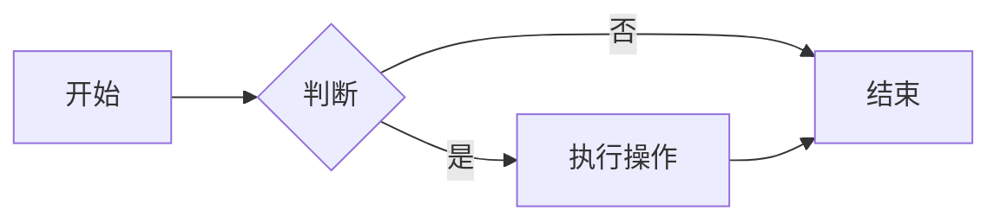
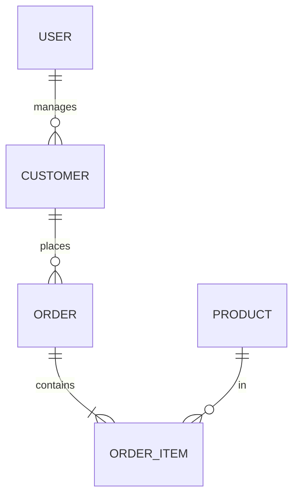
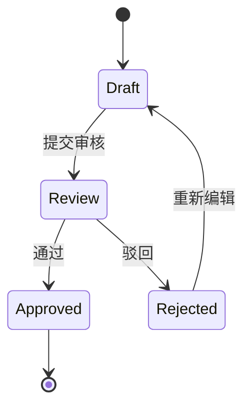
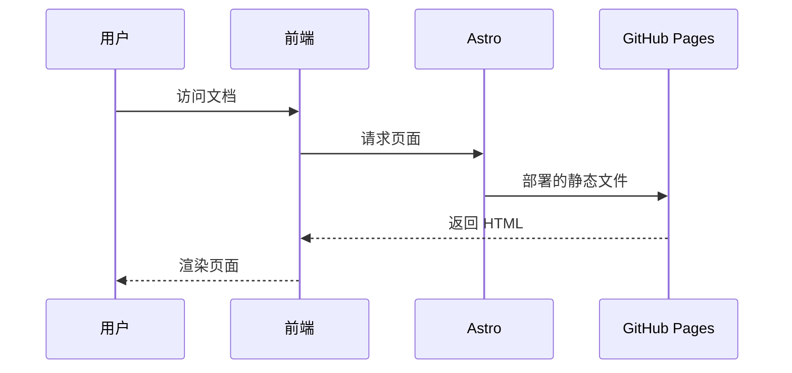

# 功能特性总览

## 核心功能

| 功能 | 说明 | 示例 |
| --- | --- | --- |
| Markdown 渲染 | 完整支持 Markdown 语法 | 标题、列表、表格、引用 |
| Mermaid 图表 | 自动渲染多种图表类型 | 流程图、ER 图、状态图 |
| 代码高亮 | 支持多语言语法高亮 | JavaScript、Python、SQL |
| 多级目录 | 支持多级文档树导航 | 见本系列文档结构 |
| 深色模式 | 亮色/暗色主题切换 | 自动跟随系统 |
| 响应式设计 | 适配移动端 | 手机/平板/桌面 |

## Mermaid 支持类型

### 流程图

### ER 图

### 状态图

### 时序图

