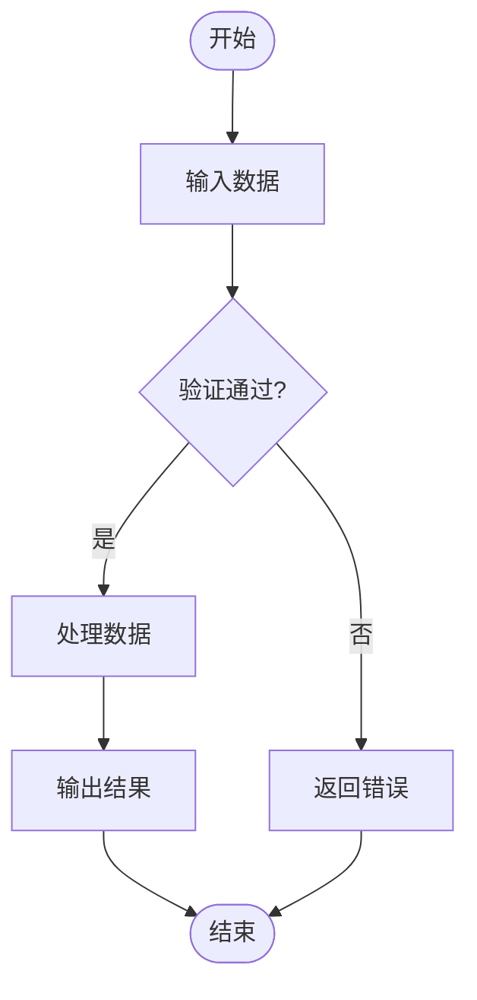
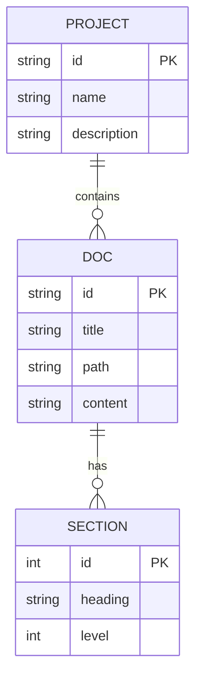
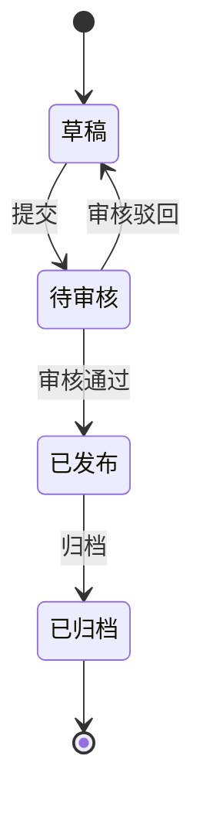
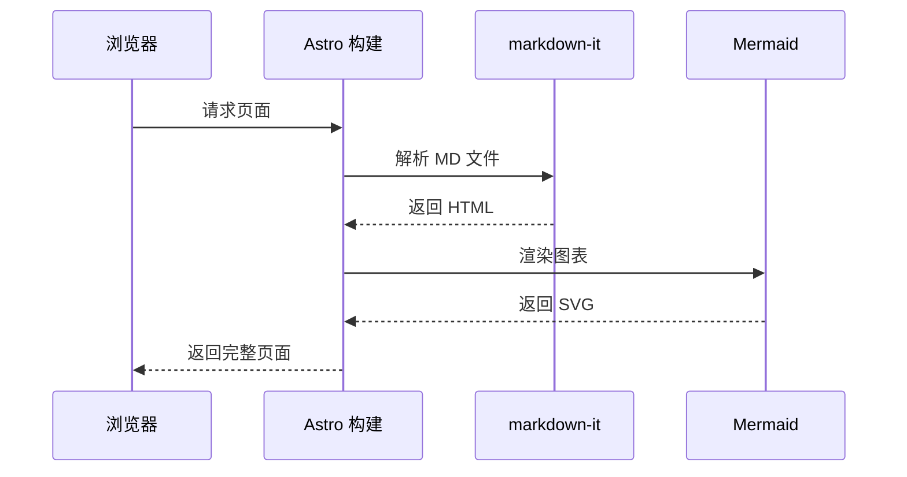
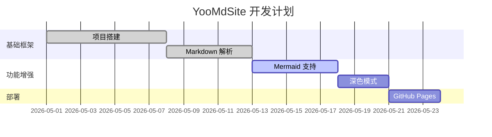

# 图表渲染能力详解

YooMdSite 内置 Mermaid.js，支持多种图表类型的自动渲染。

## 支持的图表类型

### 1. 流程图 (Flowchart)

用于展示系统流程、决策树等。



### 2. ER 图 (Entity Relationship)

用于展示数据库表关系。



### 3. 状态图 (State Diagram)

用于展示状态流转。



### 4. 时序图 (Sequence Diagram)

用于展示系统交互时序。



### 5. 甘特图 (Gantt)

用于展示项目时间线。



## 渲染原理

1. Markdown 内容中的 ```mermaid 代码块被提取
2. Mermaid.js 在客户端将代码块转换为 SVG 图表
3. 自动添加缩放、悬停放大等交互功能
4. 深色模式下自动反转图表颜色
