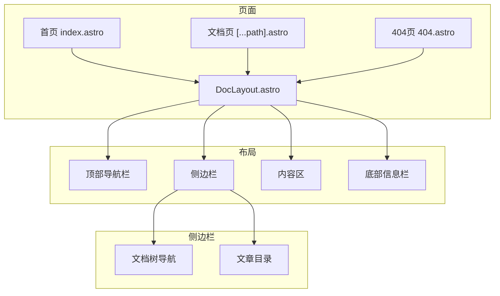
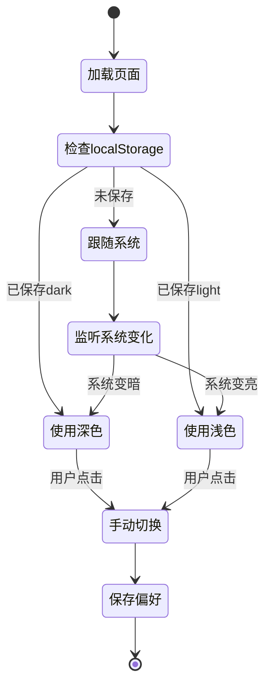

# 前端架构

## 组件结构

## 技术栈

| 技术 | 版本 | 用途 |
| --- | --- | --- |
| Astro | 4.x | 静态站点生成框架 |
| Tailwind CSS | 3.x | 原子化 CSS 框架 |
| markdown-it | 14.x | Markdown 解析 |
| Mermaid | 10.x | 图表渲染 |
| Highlight.js | 11.x | 代码语法高亮 |

## 页面路由

| 路由 | 文件 | 说明 |
| --- | --- | --- |
| `/` | `index.astro` | 首页，显示文档卡片 |
| `/docs/[...path]` | `[...path].astro` | 文档内容页 |
| `/404` | `404.astro` | 404 错误页 |

## 主题切换原理

