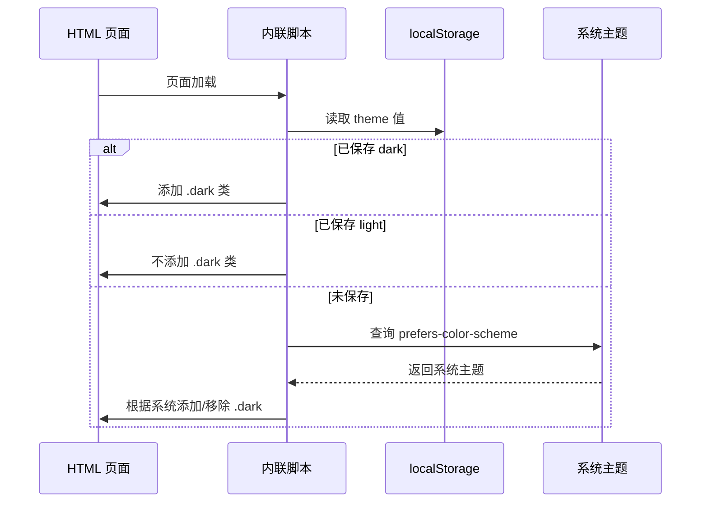

# 深色模式实现

## 实现原理

YooMdSite 的深色模式采用 Tailwind CSS 的 `class` 策略，通过给 `<html>` 元素添加 `dark` 类来切换主题。

## 初始化流程



## 监听系统主题变化

当用户未手动选择主题时，页面会监听系统主题变化：

```typescript
// 监听系统主题变化
window.matchMedia("(prefers-color-scheme: dark)")
  .addEventListener("change", (e) => {
    setTheme(e.matches, true); // true 表示自动跟随
  });
```

## 深色模式样式示例

### 亮色模式
```css
body {
  background: #ffffff;
  color: #374151;
}
```

### 暗色模式
```css
html.dark body {
  background: #111827;
  color: #e5e7eb;
}
```

## Mermaid 图表适配

深色模式下，Mermaid 图表会自动应用颜色反转滤镜，确保在深色背景上清晰可读：

```css
html.dark .mermaid-content svg {
  filter: invert(1) hue-rotate(180deg);
}
```
